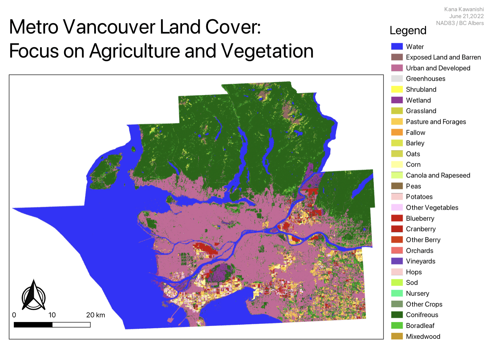
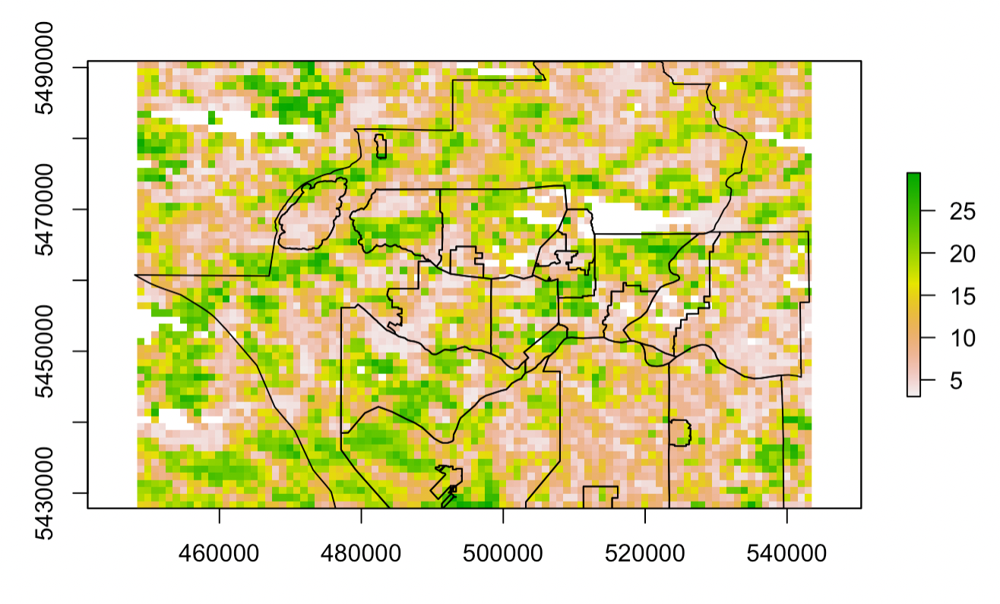

```{r setup, include=FALSE}
knitr::opts_chunk$set(echo = FALSE)
```

## Goals

-   Overall Project Goal
    -   Determine the source of citizen-science odour reports in Metro Vancouver
-   DSSG Goal
    -   Spatial patterns of biogenic emissions

    -   Spatiotemporal patterns of anthropogenic emissions

    -   Statistical linkage of emissions and odour reports

## Types of Data

-   Citizen Smell Reports
-   Concentration/Meteorological date
-   Emissions by Industry Type
-   Chemical Profiles of Emissions
-   Land use data

## Analysis for Different Emissions

-   Anthropogenic Emissions
    -   Temporal
-   Chemical Emissions
    -   Temporal
-   Biogenic Emissions
    -   Spatial

## Allocation

```{=html}
<style>
.forceBreak { -webkit-column-break-after: always; break-after: column; }
</style>
```
## Biogenic - Spatial Connection {.columns-2 .smaller}

-   Methods
    -   Obtaining the data

    -   Mapping AAFC

    -   Allocating biogenic emissions based on land cover
-   Results
    -   This figure

    -   CSV of emissions by land type

<p class="forceBreak">

</p>

```{r, out.width='100%', fig.align='center'}

```

## Anthropogenic - Temporal Connection {.columns-2 .smaller}

-   Methods
    -   Mostly Kana

    -   Temporal Allocation

        -   XXX

    -   Spatial Allocation & Scaling

        -   3D Building Heights
-   Results
    -   Temporal: Time series trends of emissions

    -   Spatial: LiDAR data
    
<p class="forceBreak">

</p>

```{r, out.width='50%', fig.align='center', fig.cap= "LiDAR Data of Metro Vancouver"}

```


## Anthropogenic - Temporal Connection Results

```{r print-dygraph, echo=FALSE, message=FALSE, warning=FALSE, fig.width=9, fig.height=5,fig.align='center'}
library(dygraphs)
library(xts)

don <- readRDS("dygraph_emissions_timeseries")

p3 <- dygraph(don, main = "Emmisions Time Series by Industry") %>%
  dyAxis("y", label = "Emissions") %>%
  dyRangeSelector() %>%
  dyCrosshair(direction = "vertical") %>%
  dyHighlight(highlightCircleSize = 5, highlightSeriesBackgroundAlpha = 0.2, hideOnMouseOut = FALSE) %>%
  dyRoller(rollPeriod = 1)

p3

```

## Chemical - Temporal Connection

-   Methods
    -   dvd
-   Results
    -   efef

## EDA

## What is the Final Goal
Given an odour report: “back trace” the likely source in terms of spatial likelihood, temporal window, and industry type. 
